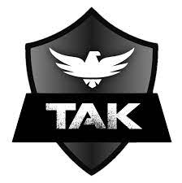
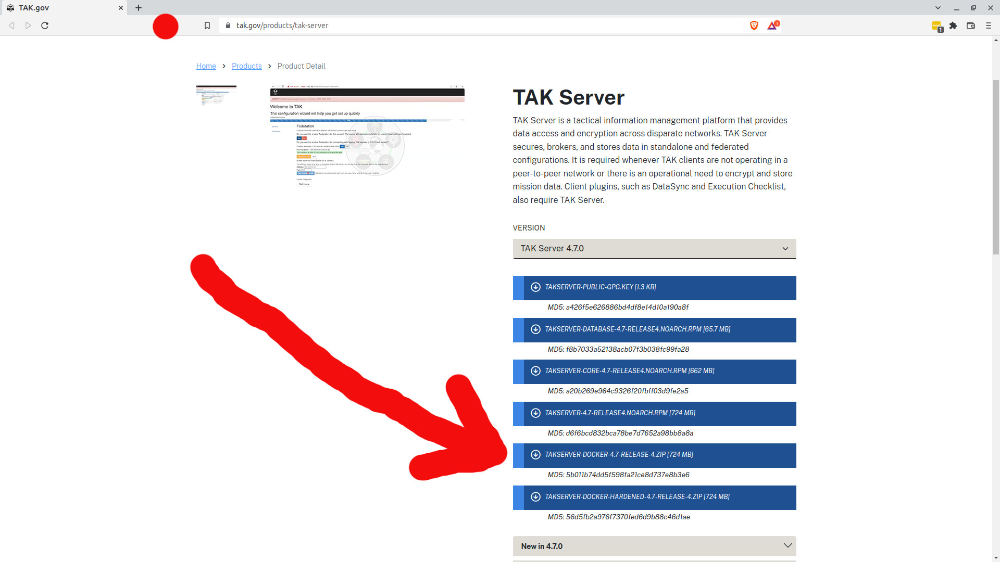

# TAK SERVER



This is a Docker wrapper for an official 'OG' TAK server from [TAK Product Center](https://tak.gov/) intended for beginners. It will give you a turnkey TAK server with SSL which works with ATAK, iTAK, WinTAK.


## IMPORTANT: Download the Official TAK Release

Before you can build this, you must download a **TAKSERVER-DOCKER-X.X-RELEASE**.

Releases are now public at [https://tak.gov/products/tak-server](https://tak.gov/products/tak-server)

Please follow account registration process, and once completed go to the link above.

The integrity of the release will be checked at setup against the MD5/SHA1 checksums in this repo. **THESE MUST MATCH**. If they do not match, **DO NOT** proceed unless you trust the release. 

Old releases are a security risk as they contain known vulnerabilities. For more information, read the big red notices on tak.gov



## TAK Server Release Checksums

| Release Filename                      | Bytes       | MD5 Checksum                       | SHA1 Checksum                              |
| ------------------------------------- | ----------- | ---------------------------------- | ------------------------------------------ |
| `takserver-docker-5.2-RELEASE-30.zip`| `517MB` | `b691d1d7377790690e1e5ec0e4a29a56` | `98f13f9140470ee65351e3d25dec097603bfb582` |
| `takserver-docker-5.2-RELEASE-43.zip`| `517MB` | `0a7398383253707dd7564afc88f29b3b` | `824d7b89fbe6377cb5570f50bb35e6e05c12b230` |
| `takserver-docker-5.3-RELEASE-24.zip`| `527MB` | `e8a5dc855c4eb67d170bf689017516e8` | `1eaad8c4471392a96c60f56bc2d54f9f3b6d719e` |
| `takserver-docker-5.3-RELEASE-30.zip`| `527MB` | `b24b5ae01aeac151565aa35a39899785` | `37c3a8f3c7626326504ab8047c42a0473961be24` |
| `takserver-docker-5.4-RELEASE-19.zip` | `522MB` | `9e6f3e3b61f8677b491d6ed15baf1813` | `2f3ced9b3e81c448e401b995f64566e7b888b991` |

## Requirements

- Debian-based operating system, such as Debian or Ubuntu
- Docker with `compose` (https://docs.docker.com/engine/install/ubuntu/ or https://docs.docker.com/engine/install/debian/)
- A TAK server release
- 4GB memory
- Network connection
- `unzip` and `netstat` utilities

## Setup Video 

Please use the below link to see a short video on a complete setup of TAK Server.

[TAK Server install (Docker)](https://www.youtube.com/watch?v=h4PA9NN-cDk)

## Prerequisites

Fetch the dependencies, then clone the git repository and `cd` into the directory

```bash
sudo apt update
sudo apt install net-tools unzip zip
git clone https://github.com/Cloud-RF/tak-server.git
cd tak-server
```

### Setup Docker's apt repository

First, set up Docker's apt repository. These steps are already completed on the WarDragon. Open a terminal and run the following commands:

```bash
# Add Docker's official GPG key:
sudo apt-get update
sudo apt-get install ca-certificates curl gnupg
sudo install -m 0755 -d /etc/apt/keyrings
curl -fsSL https://download.docker.com/linux/ubuntu/gpg | sudo gpg --dearmor -o /etc/apt/keyrings/docker.gpg
sudo chmod a+r /etc/apt/keyrings/docker.gpg

# Add the repository to Apt sources:
echo \
  "deb [arch="$(dpkg --print-architecture)" signed-by=/etc/apt/keyrings/docker.gpg] https://download.docker.com/linux/ubuntu \
  "$(. /etc/os-release && echo "$VERSION_CODENAME")" stable" | \
  sudo tee /etc/apt/sources.list.d/docker.list > /dev/null
sudo apt-get update

# Install the Docker packages.
# To install the latest version, run:
sudo apt-get install docker-ce docker-ce-cli containerd.io docker-buildx-plugin docker-compose-plugin
```

### Docker Security

**IT IS NOT RECOMMENDED TO RUN PRIVILEGED CONTAINERS ON THE DOCKER HOST.**

These scripts assume you don't need to `sudo` for `docker` and `docker-compose`. As such it is assumed that your user account is a member of the `docker` group as is indicated during the correct installation of Docker. This will allow you to run `docker` commands without `sudo`.

For more information please consult [the official installation documentation provided by Docker](https://docs.docker.com/engine/install/linux-postinstall/).

To test if you are able to run `docker` commands without `sudo` you can test with the following command:

```bash
docker run hello-world
```

### AMD64 & ARM64 (Pi4) setup 

The script will auto-detect your architecture and use the ARM Docker file if the architecture is determined to be `arm64`.

## Installation

You should copy your downloaded **TAKSERVER-DOCKER-X.X-RELEASE** ZIP file to the `tak-server` directory.

Assuming that your current working directory is the `tak-server` as cloned previously, you can then proceed to run the [setup.sh script](./scripts/setup.sh).

```bash
chmod +x scripts/setup.sh
./scripts/setup.sh
```

The `setup.sh` script will populate configuration files, start up TAK server with a PostgreSQL database via Docker compose and generate the required certificates. There will be prompts and some input required from the user such as certificate names. At the end of the setup the user will be given random passwords and a link to access the web interface where further settings can be applied.

For more information on using TAK server refer to [the documentation on the TAK Product Center GitHub](https://github.com/TAK-Product-Center/Server/tree/main/src/docs).

### Network Ports

TAK server needs the following port numbers to operate. Services already using these will cause a problem which the script will detect and offer a resolution for.

- `5432`
- `8089`
- `8443`
- `8444`
- `8446`
- `9000`
- `9001`

If you are going to expose these ports be careful. Not all of them run secure protocols. For peace of mind, and for working through firewalls and NAT routers run this on a VPN like OpenVPN or NordVPN.

### Successful Installation

If your TAK Server was able to successfully be installed then you should see in your console a similar message:

```console
Import the admin.p12 certificate from this folder to your browser as per the README.md file
Login at https://10.0.0.6:8443 with your admin account. No need to run the /setup step as this has been done.
Certificates and *CERT DATA PACKAGES* are in tak/certs/files 

Setup script sponsored by CloudRF.com - "The API for RF"

---------PASSWORDS----------------

Admin user name: admin
Admin password: <Your password here>
Postgresql password: <Your password here>

---------PASSWORDS----------------

MAKE A NOTE OF YOUR PASSWORDS. THEY WON'T BE SHOWN AGAIN.
Docker containers should automatically start with the docker service from now on.
```

## Admin Login

The login to the web interface requires the certificate created during setup. The certificate needs to be uploaded to the browser first. The name of this certificate is the one which you have typed after specifying the State, City, and Company during the certificate creation. 

Default certificate name is `admin.p12`. The certificates names can be checked by:

```bash
docker exec -it tak-server-tak-1 ls -hal /opt/tak/certs/files 
```

### Installing Your Admin Certificate

The `admin.p12` certificate needs to be copied from `./tak/certs/files/` and installed in a web browser for you to be able to administer your TAK Server. This not only provides TLS transport security with mutual authentication (Client > Server, Server > Client) but it proves your identity and saves you having to type a tedious password each time.


#### Google Chrome

* Go to **"Settings"** --> **"Privacy and Security"** --> **"Security"** --> **"Manage Certificates"**
* Navigate to **"Your certificates"** 
* Press **"Import"** button and choose your `.p12` file (Default password is `atakatak`)

The web UI should be now accessible via the address given below.

#### Mozilla Firefox

* Go to **"Settings"** --> **"Privacy & Security"** --> scroll down to **"Certificates"** section.
* Click the button **"View Certificates"**
* Choose **"Your Certificates"** section and **"Import"** your `.p12` certificate (Default password is `atakatak`)
* Choose the **"Authorities"** section
* Locate **"TAK"** line, there should be your certificate name displayed underneath it
* Click your certificate name and press button **"Edit Trust"**
* __*TICK*__ the box with **"This certificate can identify web sites"** statement, then click **"OK"**

The web UI should be now accessible via the address given below.

## Web UI Access

The web user interface can be only accessed via **SSL** on port **8443**.

The login prompt will not show up as the server authenticates the user based on the uploaded certificate.

The user interface is available at the below address and on all other NICs. Check your firewall as you may not want this exposed on a public NIC.

`https://localhost:8443`

### Re-Starting Server After Shutdown

Make sure you are in the main `tak-server` directory and append the `-d` flag to run the process in the background.

```bash
cd tak-server
docker compose up -d
```

### Shutting Down Running TAK Server

Make sure you are in the main `tak-server` directory.

```bash
cd tak-server
docker compose down
```

### Logging

You can access a shell in the running Docker container with this command:

```bash
docker exec -it tak-server-tak-1 tail -f /opt/tak/logs/takserver.log
```

To tail the server log from **OUTSITE** the container as the `tak` folder is mapped:

tail -f ./tak/logs/takserver.log

### Clean Up

```bash
sudo ./scripts/cleanup.sh
```

This script will stop the TAK Server container, remove the mapped database volume and remove the folder `tak` which is created in the project root directory (cloned from GitHub) during the setup process. 

**WARNING** - If you have data in an existing TAK database container it will be lost.

## Adding Your First EUD / ATAK Device

If you've never setup ATAK with a server before you need server and user certificates. You can load these manually as `.p12` files or the easier way is with a `.zip` data package and a manifest.

You can find ready made data packages in the `tak/certs/files` directory. You need to copy these to your device's SD card then import the `.zip` into ATAK / iTAK with the "Import" function and choose "Local SD".

This will add a server, certificates and a user account. You will still need to create this user with the matching name for example, `user1`, in your TAK server user management dashboard and assign them to a common group.

## Federated TAK server

If you would like to federate TAK servers you will need to exchange ca.pem files between servers to the fed-truststore.jks file located within tak/certs/files

```bash
keytool -importcert -file ca.pem -keystore tak-server/tak/certs/files/fed-truststore.jks -alias "tak"
```

### Transferring user certificates via HTTP

You can run a script to serve the `.zip` files on TCP port `12345`, for example, http://0.0.0.0:12345. This launches a mini Python web server and serves the content of the `share` folder which will contain your certificates. Only do this on a trusted network as it is not encrypted.

**Sharing certificates via insecure protocols is not recommended best practice. For a secure method, copy it to the SD card with a USB cable**

```console
./scripts/shareCerts.sh
Serving HTTP on 0.0.0.0 port 12345 (http://0.0.0.0:12345/) ...
10.0.0.5 - - [23/Nov/2022 15:49:52] "GET / HTTP/1.1" 200 -
10.0.0.5 - - [23/Nov/2022 15:49:54] "GET /user1-10.0.0.3.dp.zip HTTP/1.1" 200 
```

Stop the script with `Ctrl-C` once transferred to close the server.

# FAQ

See [Frequently Asked Questions](FAQ.md).

## Contributing

Please feel free to open merge requests. A beginner's guide to GitHub.com is here:

https://www.freecodecamp.org/news/how-to-make-your-first-pull-request-on-github-3/

## Authors and Acknowledgment

Thanks to the TAK product center for open-sourcing and maintaining all things TAK. 

Thanks to James Wu 'wubar' on GitLab/Discord for publishing the Docker wrapper on which this was built.

Thanks to protectionist dinosaurs, on both sides of the pond, who are threatened by TAK's open source model for the motivation :p

## Useful Links

- [TAK server on TAK.gov](https://tak.gov/products/tak-server)
- [ATAK-CIV on Google Play](https://play.google.com/store/apps/details?id=com.atakmap.app.civ&hl=en_GB&gl=US)
- [iTak on Apple App store](https://apps.apple.com/my/app/itak/id1561656396)
- [WinTAK-CIV on TAK.gov](https://tak.gov/products/wintak-civ)
